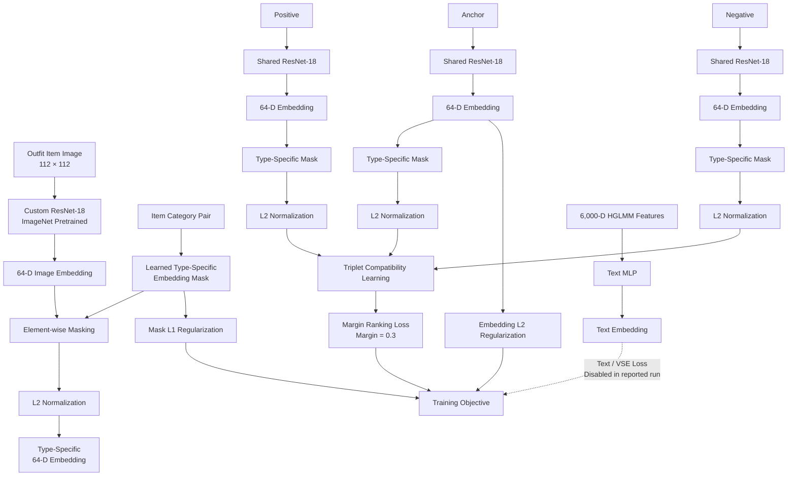

# Polyvore Outfit Compatibility

A reproduction of the **Type Conditional Similarity Network** for outfit compatibility proposed for the **Polyvore Outfits** dataset.

This project is implemented as a **single Jupyter notebook** designed to run on Kaggle. The notebook reconstructs the Polyvore dataset locally, defines the complete model architecture, trains the compatibility network, and evaluates it using Compatibility AUC and Fill In The Blank (FITB) accuracy.

The reproduced configuration achieves:

| Metric                |    Result |
| --------------------- | --------: |
| **Compatibility AUC** |  **0.88** |
| **FITB Accuracy**     | **57.3%** |

The reported experiment uses learned type specific masks and L2 normalized embeddings, with the text based losses disabled.

## Architecture



## Model

### ResNet-18 Image Encoder

The notebook implements a custom ResNet-18 based visual encoder.

The architecture uses three residual stages rather than the complete standard ResNet-18 architecture. The final `layer4` is removed and the resulting visual representation is projected into a **64-dimensional embedding** using a custom fully connected layer.

Input images are resized and center cropped to:

```text
112 × 112
```

The backbone is initialized using ImageNet pretrained weights.

### Type-Specific Embeddings

Outfit compatibility depends on the types of items being compared.

A learned mask is therefore associated with each category pair defined by the Polyvore `typespaces.p` file.

The visual embedding is transformed as:

```text
Image
  ↓
ResNet-18
  ↓
64-D embedding
  ↓
Type-specific mask
  ↓
Element-wise multiplication
  ↓
L2 normalization
  ↓
Type-specific embedding
```

This allows the network to learn different compatibility representations for different item type relationships.

### Triplet Compatibility Learning

Training uses:

```text
Anchor
   ├── Positive item
   └── Negative item
```

The positive item belongs to the same outfit as the anchor.

The negative item is sampled from another outfit while maintaining the relevant semantic category.

The network learns to place compatible item pairs closer together than incompatible pairs.

The main compatibility objective uses **Margin Ranking Loss** with:

```text
margin = 0.3
```

### Regularization

The training objective includes:

**Embedding regularization**

An L2 penalty on the general image embeddings.

**Mask regularization**

An L1 penalty on the learned type specific masks.

The reported configuration uses:

```text
embedding loss = 5e-4
mask loss      = 5e-4
```

## Text Branch

The notebook also contains the text branch used by the original architecture.

It accepts **6,000-dimensional HGLMM text features** and maps them through an MLP into a text embedding.

However, the reported experiment disables the text related losses:

```text
sim_t_loss = 0
vse_loss   = 0
```

Therefore, the reported results are from the **vision based compatibility configuration**.

## Dataset

The notebook uses the `mvasil/polyvore-outfits` dataset hosted on the Hugging Face Hub.

The notebook downloads the required metadata, task files, and image data, then reconstructs the directory structure expected by the original style PyTorch data loader.

The resulting local structure is:

```text
data/
└── polyvore_outfits/
    ├── images/
    │   └── <item_id>.jpg
    │
    ├── nondisjoint/
    │   ├── train.json
    │   ├── valid.json
    │   ├── test.json
    │   ├── typespaces.p
    │   ├── compatibility_train.txt
    │   ├── compatibility_valid.txt
    │   ├── compatibility_test.txt
    │   ├── fill_in_blank_train.json
    │   ├── fill_in_blank_valid.json
    │   └── fill_in_blank_test.json
    │
    └── polyvore_item_metadata.json
```

## Evaluation

### Compatibility AUC

For each outfit, the model calculates pairwise compatibility distances between its items.

The pairwise scores are aggregated into an outfit level score and evaluated using ROC AUC.

Higher values indicate better separation between compatible and incompatible outfits.

### Fill In The Blank

For each FITB question, one item must be selected from a set of candidate items.

The model evaluates each candidate against the remaining outfit items and selects the candidate with the lowest accumulated compatibility distance.

Accuracy measures how frequently the model selects the correct outfit item.

## Training Configuration

The reported experiment is run with:

```bash
python main.py \
    --name polyvore_run_full \
    --learned \
    --l2_embed \
    --batch-size 720 \
    --checkpoint_dir /kaggle/working/checkpoints \
    --sim_t_loss 0 \
    --vse_loss 0
```

These arguments are executed from within the notebook after `main.py` is generated by a `%%writefile` cell.

| Parameter                |         Value |
| ------------------------ | ------------: |
| Embedding dimension      |            64 |
| Input resolution         |     112 × 112 |
| Batch size               |           720 |
| Learning rate            |          5e-5 |
| Margin                   |           0.3 |
| Embedding regularization |          5e-4 |
| Mask regularization      |          5e-4 |
| Type masks               |       Learned |
| Embedding normalization  |            L2 |
| Text similarity loss     |      Disabled |
| VSE loss                 |      Disabled |
| Random seed              |            42 |
| Polyvore split           | `nondisjoint` |

## Kaggle

The notebook is designed to run on **Kaggle with 2 × NVIDIA Tesla T4 GPUs**.

When multiple CUDA devices are available, the notebook uses PyTorch `nn.DataParallel` for multi GPU training.

Run the notebook cells in order:

```text
1. Install dependencies
2. Authenticate with Hugging Face
3. Download Polyvore metadata
4. Extract dataset images
5. Define ResNet-18
6. Define Polyvore dataset loader
7. Define triplet network
8. Define type-specific network
9. Build training script
10. Train model
11. Evaluate Compatibility AUC
12. Evaluate FITB
```

## Checkpoints

Training checkpoints are written to:

```text
/kaggle/working/checkpoints/polyvore_run_full/
```

The latest checkpoint is:

```text
checkpoint.pth.tar
```

The best checkpoint is:

```text
model_best.pth.tar
```

## Notebook Implementation

Everything required for the reproduction is contained in the single notebook.

The notebook uses `%%writefile` cells to generate temporary Python modules during execution:

```text
Resnet_18.py
polyvore_outfits.py
tripletnet.py
type_specific_network.py
main.py
```

These files are **generated automatically by the notebook** and are not separate project components.

This keeps the project reproducible from a single `.ipynb` file while still allowing the training code to be organized into conventional Python modules during execution.

## Reproduction Notes

This project modernizes the original implementation for a current PyTorch environment while preserving its core compatibility learning architecture.

The notebook includes adaptations for:

* Modern PyTorch APIs
* Hugging Face dataset loading
* Reconstruction of the legacy Polyvore directory structure
* Image extraction from Parquet data
* Multi GPU training
* Modern tensor normalization operations
* Reproducible random seeds
* Checkpoint and optimizer state restoration

The objective is to reproduce the core **type specific compatibility learning approach** rather than claim an unmodified reproduction of the original source code.

## Results

| Metric                | Reproduced |
| --------------------- | ---------: |
| **Compatibility AUC** |   **0.88** |
| **FITB Accuracy**     |  **57.3%** |

**Reported configuration:** learned type specific masks, L2 normalized embeddings, triplet compatibility learning, embedding and mask regularization, with text/VSE losses disabled.
